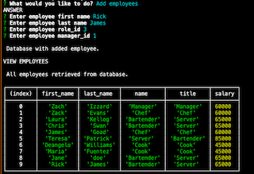
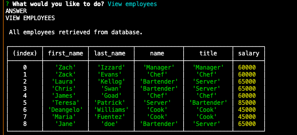
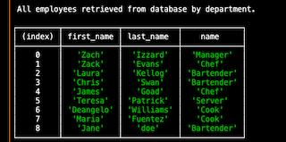

# Employee Tracker
  
  ## Table of Contests
  -[Description](#description)
  -[Instalation](#install)
  -[Usage](#usage)
  -[Licences](#licences)
  -[Contribution](#contribution)
  -[Test](#tests)
  -[Question](#questions)
  
  
  ## Description
  To help large companies keep track of their employees and everything going on I created a database
  containing three table. The first department just contains the name of the department so we can
  start to pinpoint where at in the company the employee works. The second was the role table, 
  which started filling in the title of the role along with the salary. The last one was the 
  employee table which contained the general information of the employee along with a role id and
  a manager id. From these tables you can add or view from any of these tables to quickly bring up
  information needed. You can also update the employee roles for future promotions or the unfortunate 
  demotion that can happen.

  
  ## Install

  npm install
  
  ## Usage

  As a business owner
  I want to be able to view and manage the departments, roles, and employees in my company
  So that I can organize and plan my business
  
  
  ## Licence

  None
  
  ## Contribution

  
  ## Test
  
  NA
  
  ## Questions

  ### [cfergus7 GitHub](https://github.com/)  
  
  ### Email cfergus7@gmail.com

  ### https://dashboard.heroku.com/apps/whispering-oasis-17117

  ## Screen Shots
  

  

  
